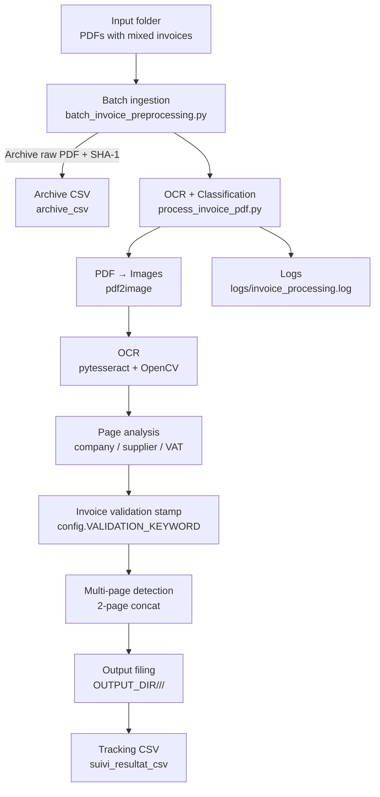

# Automated Invoice OCR & Filing System

## Project Overview

This project implements an automated invoice processing system designed to extract,classify and file scanned pdf invoices
in a strucutured and traceable way.

It combines OCR (Tesseract), image preprocessing (OpenCV) , and rule-based matching to detect companies, suppliers, and VAT numbers
from invoice documents.

This system is built to support the batch processing, the file structured and full traceability, through csv tracking and logging

## Table of contents

## Introduction

Sometimes in accounting workflows, pdf's file can contain numerous invoices merged and scanned in a random order. This files mix lot of different information like company, supplier...

Manually splitting, indentifying, and filing such invoices is time consuming,  error-prone and difficult to track at scale.

The project addresses this problem by automatically analysing each pdf , detecting one-page invoice (and two-pages-invoice) and classifying them in the appropriate company and supplier directories

For each invoice, the system :

  -  Extract text from the PDF's file scanned
  -  Identifies the target subsidiary of the receiving organisation and the supplier
  -  Validates that the page is an invoice detecting the validation internal stamp configurable in the system settings
  -  handler invoices-two-page
  -  Saved the processed invoiced in the appropriate directory
  - Archive the raw/original pdf
  - Save traceability information in csv files

## Installation

### 1. Clone the repository

```bash
git clone https://github.com/invoice_classifier/classifier.git
cd classifier
```

### 2. Run docker-compose:

```bash
docker-compose up -d --build
```

## Architecture

```

LUX_INVOICE_2/
│
├── .streamlit/
│   └── config.toml                 # Streamlit configuration
│
├── data/
│   ├── raw_invoices_to_process/    # Incoming raw PDFs
│   ├── company_list.csv            # Company registry reference
│   └── supplier_list.csv           # Supplier registry reference
│
├── logs/
│   └── invoice_processing.log      # Application logs
│
├── script/
│   └── Lancer_LuxInvoice.bat       # Windows launcher
│
├── src/
│   ├── __init__.py
│   ├── batch_invoice_preprocessing.py  # Batch ingestion pipeline
│   ├── process_invoice_pdf.py          # OCR + classification engine
│   ├── config.py                       # Configuration & constants
│   ├── main.py                         # Application entry logic
│   └── utils.py                        # Helper functions
│
├── app.py                          # Streamlit application entry point
├── Dockerfile
├── docker-compose.yml
├── requirements.txt
├── requirements_docker.txt
└── README.md


```

### Folder Descriptions

## Architecture Diagram




