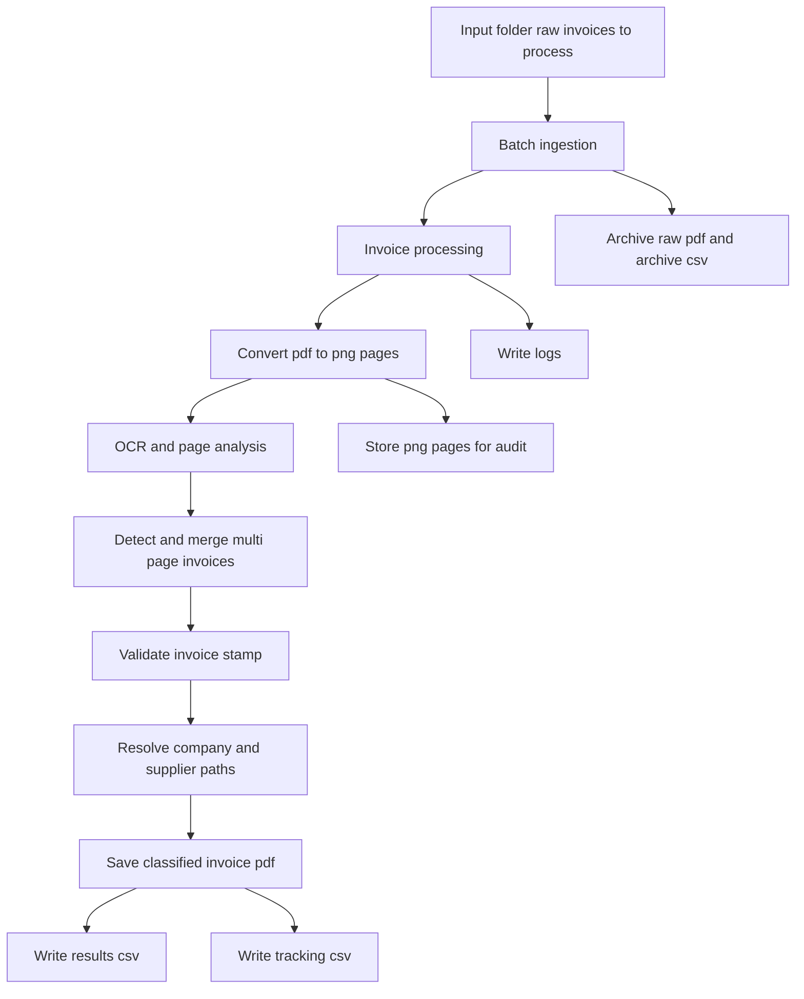

# Automated Invoice OCR & Filing System

## Project Overview

This project implements an automated invoice processing system designed to extract,classify and file scanned pdf invoices
in a strucutured and traceable way.

It combines OCR (Tesseract), image preprocessing (OpenCV) , and rule-based matching to detect companies, suppliers, and VAT numbers
from invoice documents.

This system is built to support the batch processing, the file structured and full traceability, through csv tracking and logging

## Table of contents

## Introduction

Sometimes in accounting workflows, pdf's file can contain numerous invoices merged and scanned in a random order. This files mix lot of different information like company, supplier...

Manually splitting, indentifying, and filing such invoices is time consuming,  error-prone and difficult to track at scale.

The project addresses this problem by automatically analysing each pdf , detecting one-page invoice (and two-pages-invoice) and classifying them in the appropriate company and supplier directories

For each invoice, the system :

  -  Extract text from the PDF's file scanned
  -  Identifies the target subsidiary of the receiving organisation and the supplier
  -  Validates that the page is an invoice detecting the validation internal stamp configurable in the system settings
  -  handler invoices-two-page
  -  Saved the processed invoiced in the appropriate directory
  - Archive the raw/original pdf
  - Save traceability information in csv files

## Installation

### 1. Clone the repository

```bash
git clone https://github.com/invoice_classifier/classifier.git
cd classifier
```

### 2. Run docker-compose:

```bash
docker-compose up -d --build
```

### 3. Architecture

#### Project structure
```

LUX_INVOICE_2/
│
├── .streamlit/
│   └── config.toml                 # Streamlit configuration
│
├── data/
│   ├── raw_invoices_to_process/    # Incoming raw PDFs
│   ├── company_list.csv            # Company registry reference
│   └── supplier_list.csv           # Supplier registry reference
│
├── logs/
│   └── invoice_processing.log      # Application logs
│
├── script/
│   └── Lancer_LuxInvoice.bat       # Windows launcher
│
├── src/
│   ├── __init__.py
│   ├── batch_invoice_preprocessing.py  # Batch ingestion pipeline
│   ├── process_invoice_pdf.py          # OCR + classification engine
│   ├── config.py                       # Configuration & constants
│   ├── main.py                         # Application entry logic
│   └── utils.py                        # Helper functions
│
├── app.py                          # Streamlit application entry point
├── Dockerfile
├── docker-compose.yml
├── requirements.txt
├── requirements_docker.txt
└── README.md


```

#### Architecture Diagram


## 4.  Folder Description

### raw_invoices_to_process/

  - Contains raw pdf files to be processesd
  - Each file contain multiple mixed invoice
  - After successful processing, files are moved to the archive folder archived_raw_invoices/raw_invoices/,ensuring that it will not be processed again

  #### raw_invoices/
  The main purpose of this folder is to track processed file and ensured that files are not preprocessed twice

  Archive of processed raw PDFs
    - Store the original PDF before preprocessing

  #### Tracking file
  
  **Archive_raw_invoices.csv** :
    
  colummns : 
    - raw_invoice
    - date
    - check-in time
    - sha1_pdf

this file ensures traceability of incoming documents

### classified_invoices/

This folder contains the filed pdf invoices , result of the pipeline .

Invoices are saved on the following path (2 configurations) : 

```
  - company/supplier/invoice_time_stamp.pdf
  - parent_company/company/supplier/invoice_timestamp.pdf

```

  ### Session summary file

  results.csv 

  columns : 
  - invoice_processed
  - parent_company
  - company_name
  - supplier_name
  - date
  - sha1_pdf
    
  This file is used for result verification and control at the end of the session

### tracking/

This folder contains files and folder for tracking and checking results

  ### Processed_invoice_archive/
  This folder contains all the invoice's page on the format PNG. For exemple 50 pages PDF generates 50 PNG files.
  In addition it allows manual verification by accounting staff

  ## Processed_invoices_tracking.csv
  
  columns : 
  - invoice_processed
  - parent_company
  - company_name
  - supplier_name
  - date
  - sha1_pdf

 ### Reference and mapping table 

 The systeme relies on two CSV mapping table

  company_list.csv
  columns : 
    - company_name_invoice (company name in the invoice)
    - company_name_registery (folder name)
    - ID_TVA
    - parent_company

  supplier_list.csv
  columns : 
    - supplier_invoice (supplier name on the invoice)
    - supplier registery (folder name)
    - TVA

 These files contain reference data used to match OCR-extracted text with the name of the company (company_name_invoice) . The system searches for a match with the VAT number or the company name or supplier name 
 written on the invoice.


